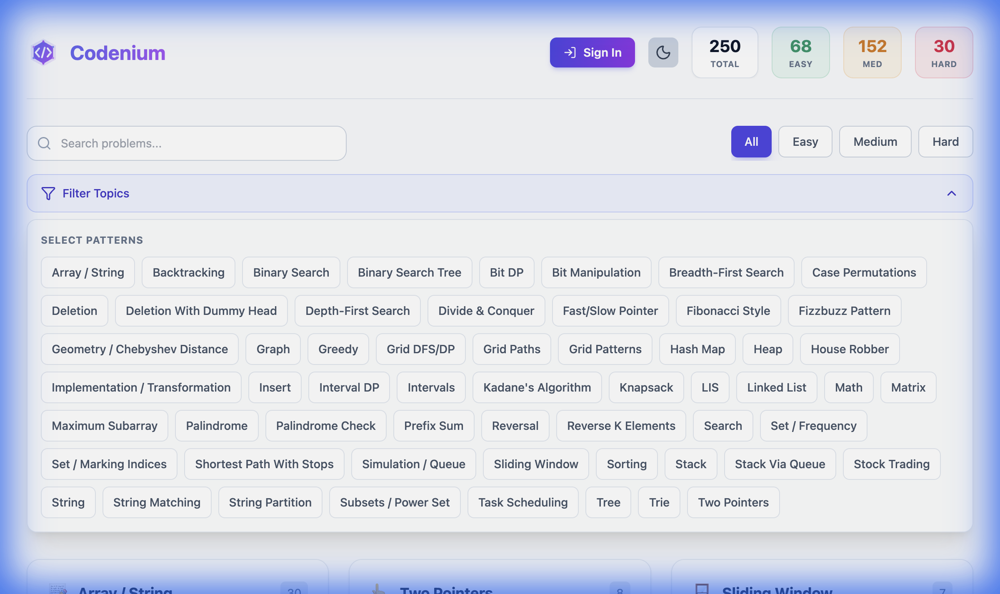
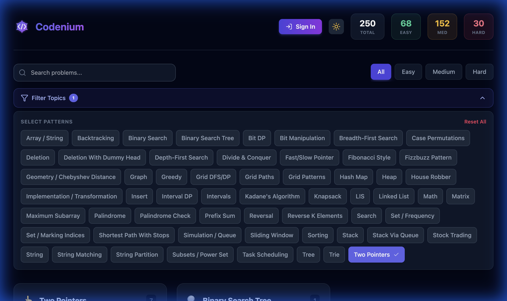
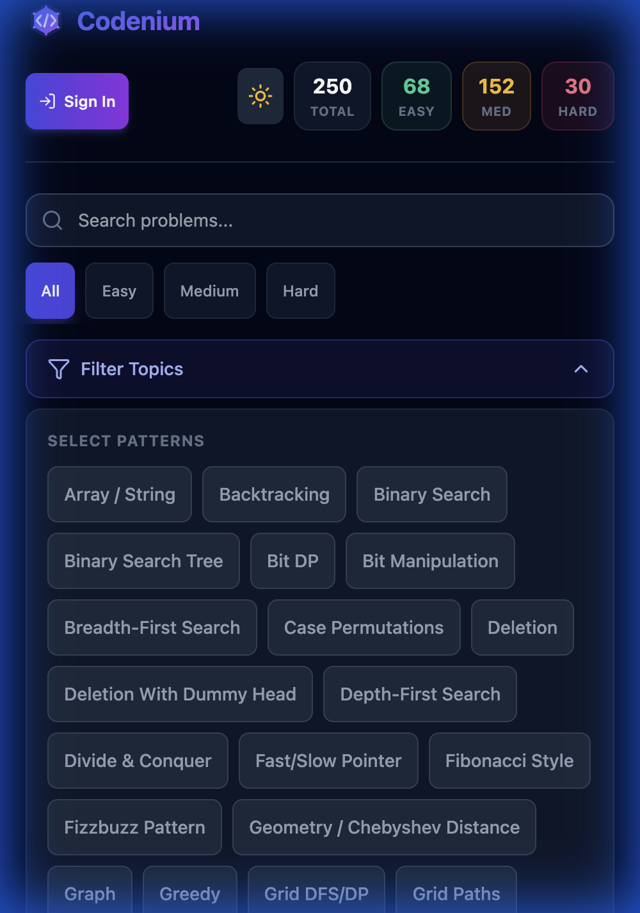

# Visual Learning Platform (Codenium) 🚀

A next-generation platform for visualizing algorithms and data structures. Built with high-performance visualization engines and a vast library of interactive content.


*Interactive Walkthrough: Unified Filter System & Responsive Design*

## 🌟 Key Features

### 1. **Massive Content Library**
- **250+ Scenarios**: Coverage of Arrays, Trees, Graphs, DP, Backtracking, and more.
- **100% Enhanced**: Every single problem features detailed, step-by-step animations.
- **Interactive**: Scrub, replay, and speed control for every visualization.

### 2. **Unified Filter System** 🔍
- **Consistent UX**: A streamlined, collapsible filter menu works identically across all devices.
- **Pattern-Based Progression**: Easily filter problems by pattern (e.g., *Two Pointers*, *Sliding Window*).
- **Difficulty Ladders**: Master concepts by progressing from **Easy** -> **Medium** -> **Hard**.

### 3. **Cognitive & Accessibility Tools** 🎤
- **Voiceover Mode**: Text-to-Speech narration of the problem intuition.
- **Mental Models**: Visual analogies (e.g., "Sliding Window is like a Caterpillar") for **100% of problems (250+)**.
- **Tutor Chat**: AI-powered context-aware assistance.

### 4. **High-Performance Architecture**
- **Trie-Based Search Engine**: Instant fuzzy search with **O(L)** complexity and memoization.
- **SmartVisualizer™ Engine**: Unified rendering for Arrays, Matrices, Trees, and Graphs.
- **Dynamic State Panel**: Real-time tracking of variable values (i, j, left, right).

## 🎨 Design & Experience

### Premium Light & Dark Modes
The platform features a fully responsive design with native Light and Dark mode support, now enhanced with a unified toolset.

| Light Mode (Desktop) | Filters Open (Dashboard) |
|------------|-----------|
|  |  |

### Mobile Responsiveness
Optimized for all devices. The filter system adapts its layout while maintaining full functionality on smaller screens.



## 🏗️ Architecture Overview

The system follows a Hexagonal Architecture pattern, separating the core domain logic from the driving (UI/API) and driven (AI/DB) adapters.

```mermaid
graph TD
    subgraph Frontend ["React PWA (Port 3000)"]
        User[User] -->|Interact| View[UI Components]
        View -->|Query| ViewModel[ViewModels (MVVM)]
        
        ViewModel -->|Fast Search| Trie[Local Search Engine]
        ViewModel -->|Data fetch| APIClient[API Client]
    end

    subgraph Backend ["Node.js Express (Port 3001)"]
        APIClient -->|REST| Controller[API Controllers]
        
        Controller -->|Use Case| Service[Problem Service]
        
        Service -->|Load| AdapterFS[File Repository Adapter]
        Service -->|Execute| AdapterExec[Execution Service]
        Service -->|Inference| AdapterAI[AI Service (OpenAI/Ollama)]
        
        AdapterFS --> JSON[(JSON Data Store)]
        AdapterExec --> Python[Python Runtime]
        AdapterAI --> LLM[LLM Provider]
    end
```

### Core Modules
| Module | Description |
|--------|-------------|
| **frontend/src/viewmodels** | Handles business logic, filtering, and local state management. |
| **api/src/application** | Core business rules and service orchestration. |
| **api/src/adapters** | Interfaces to external systems (File System, AI, Code Execution). |
| **frontend/src/utils/SearchEngine.ts** | Highly optimized Trie implementation for client-side search. |
| **api/data/** | Static JSON content serving as the primary database. |

## 📘 Runbook / Operations

### 1. Prerequisites
- Node.js (v18+)
- Python 3.9+ (for backend operations)
- `pip` (Python package manager)

### 2. Setup & Installation
```bash
# Install dependencies for both Frontend and Backend
make install
```

### 3. Start Development Environment
This command starts both the React Frontend (Port 3000) and the Node.js Backend (Port 3001) concurrently.

```bash
# Start Development Server (Full Stack)
make dev
# OR equivalently
./start.sh
```

**Access Points:**
- **Frontend App**: `http://localhost:3000`
- **Backend API**: `http://localhost:3001`

### 4. Maintenance Scripts
The `scripts/` directory contains tools to manage the 250+ problem dataset.

| Script | Purpose | Run Command |
|--------|---------|-------------|
| **validate-all-data.js** | Audits dataset integrity (missing fields, broken links). | `make test` |
| **generate-learning-paths.js** | Links problems (Easy->Hard) and generates 'Suggested Next'. | `node scripts/generate-learning-paths.js` |

## 🧪 Tech Stack

- **Frontend**: React 18, TypeScript, Vite, TailwindCSS
- **Backend**: Node.js, Express, TypeScript
- **Architecture**: Hexagonal (Ports & Adapters)
- **AI Integration**: OpenAI / Ollama (Pluggable Adapter)
- **Data**: JSON-based static content + Runtime In-Memory Cache

## ✅ Validation Status

- **Build**: Passing (Vite Prod Build)
- **Coverage**: 252/252 Solutions Enhanced
- **Mental Models**: 100% Saturation (252/252)
- **Features**: Unified Filter, Search, Learning Paths Verified.
