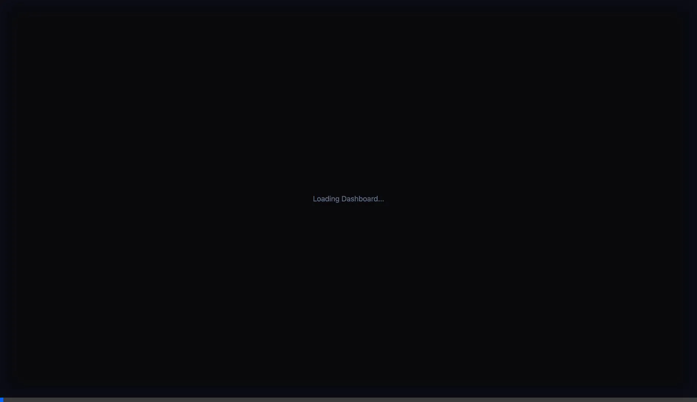
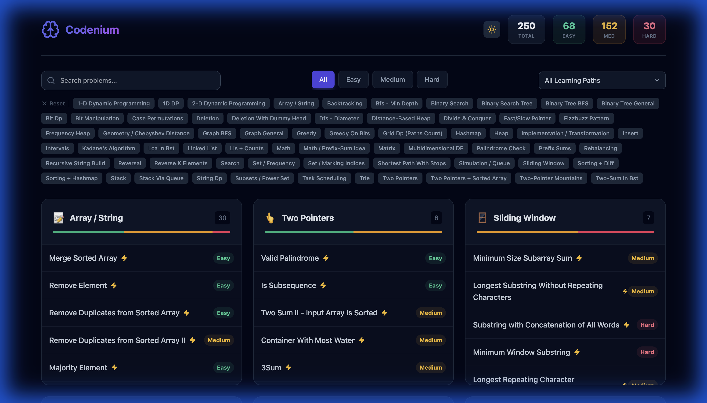

# Visual Learning Platform (Codenium) 🚀

A next-generation platform for visualizing algorithms and data structures. Built with high-performance visualization engines and a vast library of interactive content.


*Interactive Visualization Demo*

## 🌟 Key Features

### 1. **Massive Content Library**
- **250+ Scenarios**: Coverage of Arrays, Trees, Graphs, DP, Backtracking, and more.
- **100% Enhanced**: Every single problem features detailed, step-by-step animations.
- **Interactive**: Scrub, replay, and speed control for every visualization.

### 2. **Structured Learning Paths** 🧠
- **Pattern-Based Progression**: Problems are linked by pattern (e.g., *Two Pointers*).
- **Difficulty Ladders**: Master concepts by progressing from **Easy** -> **Medium** -> **Hard**.
- **Next Question Guided Flow**: The UI suggests the next logical problem to solve.

### 3. **Cognitive & Accessibility Tools** 🎤
- **Voiceover Mode**: Text-to-Speech narration of the problem intuition.
- **Mental Models**: Visual analogies (e.g., "Sliding Window is like a Caterpillar") for **100% of problems (250+)**.
- **Tutor Chat**: AI-powered context-aware assistance.

### 4. **High-Performance Architecture**
- **Trie-Based Search Engine**: Instant fuzzy search with **O(L)** complexity and memoization.
- **SmartVisualizer™ Engine**: Unified rendering for Arrays, Matrices, Trees, and Graphs.
  - **Dynamic State Panel**: Real-time tracking of variable values (i, j, left, right).


*Graph Visualization Example*

## 🏗️ Architecture Overview

The system follows a clean **MVVM (Model-View-ViewModel)** architecture with a focus on static data performance.

```mermaid
graph TD
    User[User] -->|Search/Filter| ViewModel[useProblems ViewModel]
    ViewModel -->|Query| Trie[SearchEngine (Trie + Cache)]
    ViewModel -->|Data| App[App Component]
    
    App -->|Select Problem| SolutionModal[Solution Modal]
    SolutionModal -->|Navigation| NextProblem[Next Question Logic]
    SolutionModal -->|Voice| Speech[Web Speech API]
    
    SolutionModal -->|Render| SmartViz[SmartVisualizer Component]
    SmartViz -->|Render| MatrixViz[Matrix Visualizer]
    SmartViz -->|Render| GraphViz[Graph Visualizer]
    SmartViz -->|Render| TreeViz[Tree Visualizer]
    
    Data[Solutions.json] -->|Load| ViewModel
    Data -->|Index| Trie
```

### Core Modules
| Module | Description |
|--------|-------------|
| **frontend/src/viewmodels** | Handles business logic, filtering, and state management. |
| **frontend/src/models** | Data access layer (API wrappers). |
| **frontend/src/utils/SearchEngine.ts** | Highly optimized Trie implementation for search. |
| **api/data/** | Static JSON content serving as the database. |

## 📘 Runbook / Operations

### 1. Setup & Installation
```bash
# Install dependencies
npm install

# Start Development Server
./start.sh
```
Access at `http://localhost:3000`.

### 2. Maintenance Scripts
The `scripts/` directory contains tools to manage the 250+ problem dataset.

| Script | Purpose | Run Command |
|--------|---------|-------------|
| **validate-all-data.js** | Audits dataset integrity (missing fields, broken links). | `node scripts/validate-all-data.js` |
| **inject-mental-models.js** | Injects analogies into solutions based on patterns. | `node scripts/inject-mental-models.js` |
| **generate-learning-paths.js** | Links problems (Easy->Hard) and generates 'Suggested Next'. | `node scripts/generate-learning-paths.js` |
| **sync-difficulty.js** | Syncs difficulty ratings between listing and details. | `node scripts/sync-difficulty.js` |

### 3. Adding New Content
1. Add entry to `api/data/problems.json`.
2. Add detailed solution to `api/data/solutions.json`.
3. Run `node scripts/generate-learning-paths.js` to link it into the graph.
4. Run `node scripts/validate-all-data.js` to ensure quality.

## 🧪 Tech Stack

- **Frontend**: React 18, TypeScript, Vite
- **Styling**: TailwindCSS (Dark/Light Mode)
- **State**: MVVM Hooks + React Context
- **Visualization**: Custom SVG/HTML5 renderers (No heavy canvas libs)
- **Data**: JSON-based static content (Pre-computed steps for performance)

## ✅ Validation Status

- **Build**: Passing (Vite Prod Build)
- **Coverage**: 252/252 Solutions Enhanced
- **Mental Models**: 100% Saturation (252/252)
- **Features**: Voiceover, Search, Learning Paths Verified.
