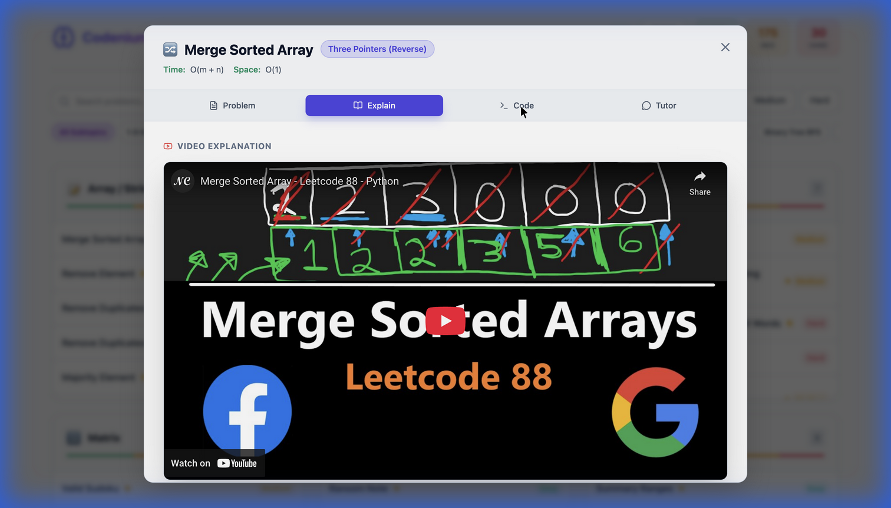
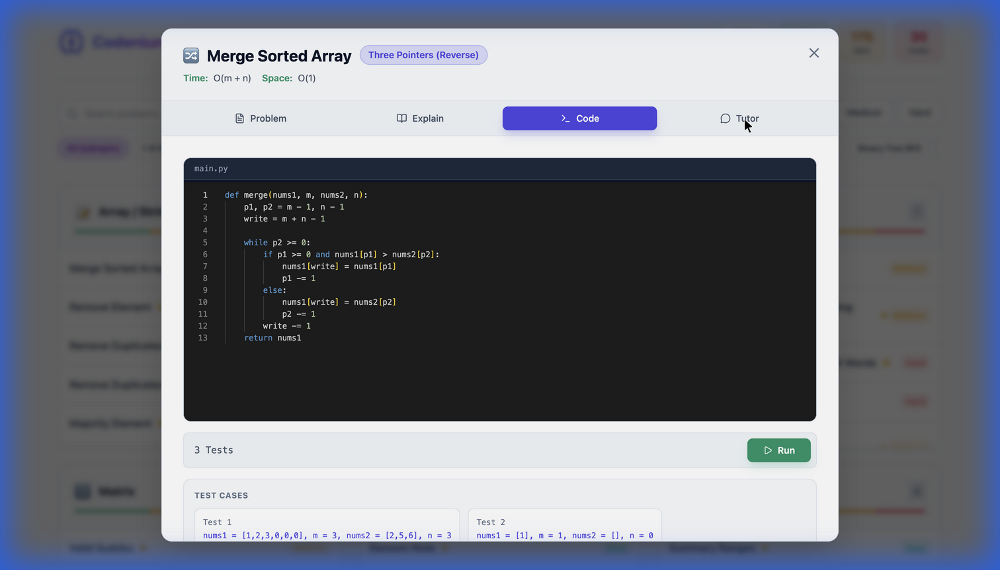
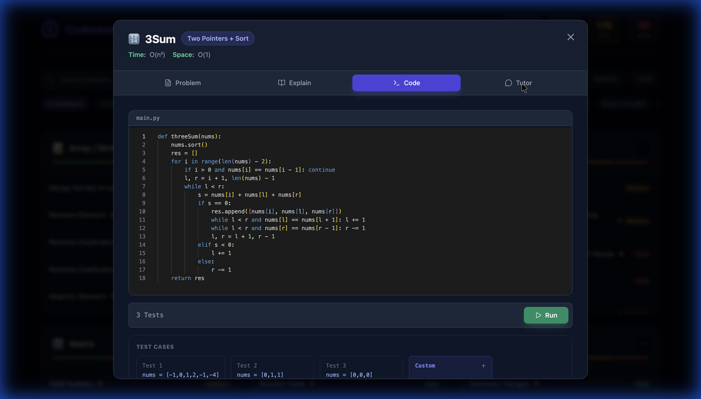
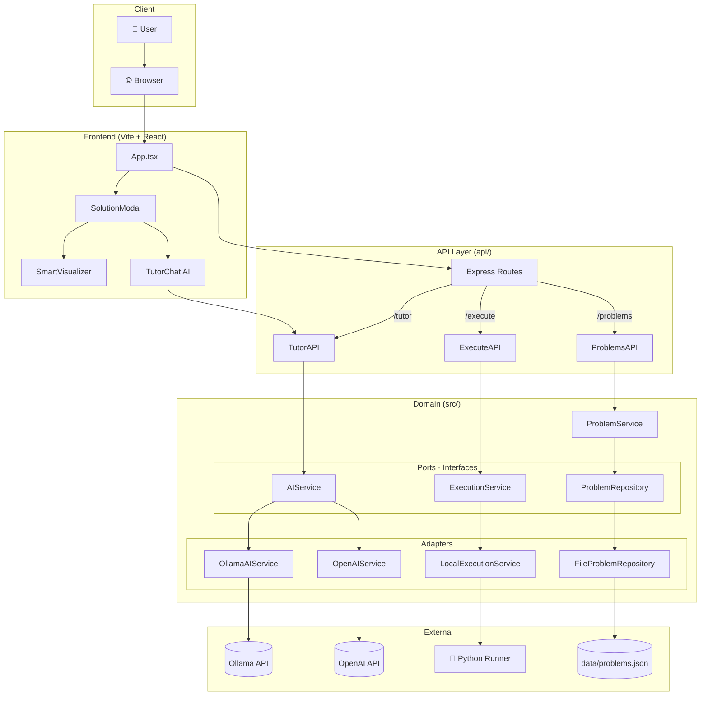

# Codenium

A visual learning platform for coding, designed for focused minds. Codenium helps you understand algorithms through visualizations, interactive practice, and AI-powered tutoring.

## Demo


*Full demo showing light and dark modes with consistent UI, search/filter functionality, and all modal tabs.*

### Screenshots

| Code Playground | AI Tutor | Dark Mode |
|:---:|:---:|:---:|
|  |  |  |


## Features

- **Visual Problem Explorer**: Dashboard of Top 150 Interview questions with progress tracking
- **Smart Visualizations**: AI-generated algorithm visualizations (Two Pointers, Sliding Window, etc.)
- **Interactive Playground**: Run Python code against test cases directly in the browser
- **AI Tutor**: Socratic learning agent to help you understand and derive solutions

## Architecture



## Quick Start

```bash
# Clone and install
git clone https://github.com/yourusername/leetcode-visual.git
cd leetcode-visual

# Install all dependencies (one command)
npm install && cd frontend && npm install && cd ../api && npm install && pip install -r requirements.txt && cd ..

# Configure environment
cp .env.example .env
# Edit .env with your AI provider settings

# Start the app
./start.sh
```

### Environment Configuration

| Variable | Description | Example |
|----------|-------------|---------|
| `AI_PROVIDER` | AI backend (`ollama` or `openai`) | `ollama` |
| `OLLAMA_BASE_URL` | Ollama API endpoint | `http://localhost:11434` |
| `OLLAMA_MODEL` | Model name | `qwen2.5-coder:14b` |
| `OPENAI_API_KEY` | OpenAI key (if using OpenAI) | `sk-...` |

### URLs

| Service | URL |
|---------|-----|
| Frontend | http://localhost:3000 |
| API | http://localhost:3001 |

## Deployment (Vercel)

```bash
# Install Vercel CLI
npm i -g vercel

# Deploy
vercel deploy --prod

# Set environment variables in Vercel Dashboard:
# - AI_PROVIDER=openai
# - OPENAI_API_KEY=your-key
```

## Project Structure

```
leetcode-visual/
├── frontend/          # React + Vite frontend
├── api/               # Express API routes (Vercel serverless)
├── src/               # Domain logic (Hexagonal Architecture)
│   ├── domain/        # Business logic & ports
│   └── adapters/      # AI, repository, execution implementations
├── data/              # Problem data (JSON)
└── docs/              # Screenshots & videos
```

## License

MIT
