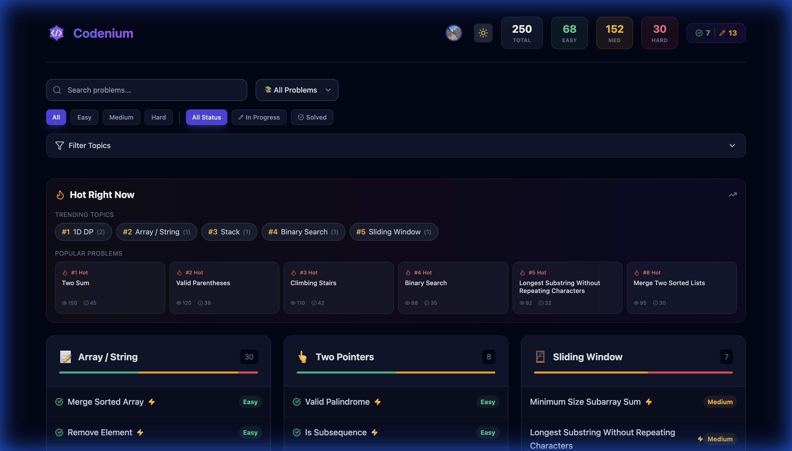

# LeetCode Visualizer

A full-stack application for visualizing LeetCode problems, generating solutions with AI, and getting personalized tutoring.



## Features

- **Problem Explorer**: Visual dashboard of Top 150 Interview questions.
- **Smart Visualizations**: AI-generated visualizations for algorithms (Two Pointers, Sliding Window, etc.).
- **Interactive Playground**: Run Python code against test cases directly in the browser.
- **AI Tutor**: Socratic agent to help you derive solutions.

## Architecture

The application uses a **Hexagonal Architecture** (Ports & Adapters) backend deployed as Vercel Serverless Functions.

```mermaid
graph TD
    User[User] -->|Interacts| Frontend[Frontend (Vite + React)]
    Frontend -->|HTTP Requests| API[Node.js API (Express/Vercel)]
    
    subgraph "Backend (api/)"
        API -->|Orchestrates| ProblemService[ProblemService]
        
        subgraph "Hexagonal Domain"
             ProblemService -->|Uses| Ports[Ports Interfaces]
        end
        
        subgraph "Adapters"
            Ports -->|Implemented By| AIAdapter[OpenAIService]
            Ports -->|Implemented By| Repo[FileProblemRepository]
            Ports -->|Implemented By| Exec[LocalExecutionService]
        end
        
        AIAdapter -->|External API| OpenAI[OpenAI API]
        Exec -->|Spawns| Runner[Python Runner Bridge]
    end
```

### Components

1.  **Node.js API (`api/index.ts`)**: The composition root and entry point.
2.  **Hexagonal Core (`api/src/domain`)**: Pure business logic and MCP tool definitions.
3.  **Python Bridge (`api/execute.py`)**: Handles code execution. In production (Vercel), this is a separate Python Serverless Function. Locally, it's spawned by Node.js.

## Getting Started

### Prerequisites

- Node.js 18+
- Python 3.9+

### Configuration

Create a `.env` file in the root directory:

```ini
OPENAI_API_KEY=sk-...
```

### Quick Start

We provide a script to start both the Frontend and Backend services.

```bash
# 1. Install dependencies
npm install
cd frontend && npm install
cd ../api && npm install && pip install -r requirements.txt

# 2. Start the App
./start.sh
```

- Frontend: `http://localhost:3000`
- Backend API: `http://localhost:3001`

## Deployment

The project is designed for **Vercel**.

1. Install Vercel CLI: `npm i -g vercel`
2. Deploy: `vercel deploy`
3. Add Environment Variables in Vercel Dashboard (`OPENAI_API_KEY`).

The `vercel.json` ensures that `/api/execute` routes to the Python function, while other API routes go to the Node.js function.
