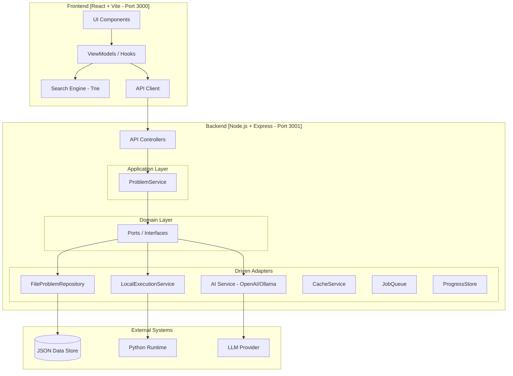
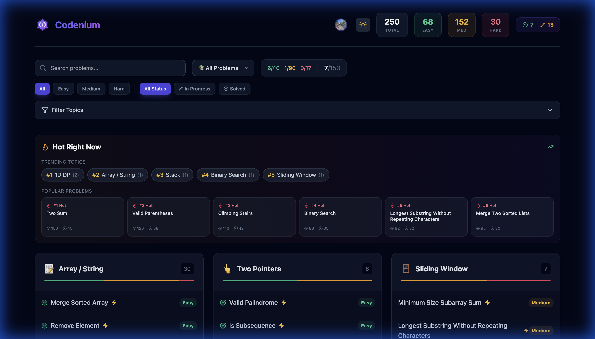
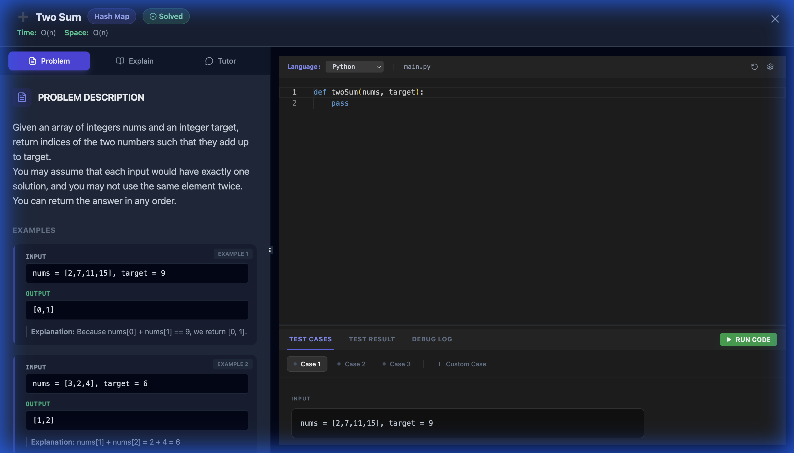

# Codenium 🚀

> A premium, next-generation platform for visualizing algorithms and data structures with interactive step-by-step animations, AI-powered tutoring, and a comprehensive library of 250+ LeetCode problems.


*Interactive Problem Dashboard with Hot Topics, List Filters, and Categories*

---

## 📑 Table of Contents

1. [Overview](#-overview)
2. [Key Features](#-key-features)
3. [Architecture](#-architecture)
4. [Tech Stack](#-tech-stack)
5. [Getting Started](#-getting-started)
6. [Runbook](#-runbook)
7. [API Reference](#-api-reference)
8. [Scripts & Utilities](#-scripts--utilities)
9. [Deployment](#-deployment)
10. [Troubleshooting](#-troubleshooting)
11. [Contributing](#-contributing)

---

## 🌟 Overview

Codenium is a full-stack learning platform designed to help developers master coding interview patterns through visual, interactive problem-solving. It combines:

- **250+ LeetCode problems** with step-by-step visualizations
- **AI-powered tutoring** (OpenAI/Ollama) for personalized hints and explanations
- **Interactive code execution** with real-time feedback
- **Progress tracking** with cloud sync and local persistence

---

## ✨ Key Features

### 1. **Massive Content Library**
| Metric | Value |
|--------|-------|
| Total Problems | 252 |
| Visualization Coverage | 100% |
| Mental Models | 100% |
| Video Explanations | 95%+ |

### 2. **Interactive Visualizations**
- **SmartVisualizer™ Engine**: Unified rendering for Arrays, Matrices, Trees, Graphs, and Linked Lists
- **Animation Controls**: Scrub, replay, speed control, and step-through
- **State Tracking**: Real-time display of variables (i, j, left, right, etc.)

### 3. **AI-Powered Learning**
- **Tutor Chat**: Context-aware AI assistant understands the current problem
- **Hint Generation**: Progressive hints without giving away solutions
- **Solution Explanation**: Detailed breakdowns of time/space complexity

### 4. **Developer Experience**
- **Monaco Code Editor**: VS Code-powered editor with Vim mode support
- **Multi-Language Execution**: Python, JavaScript, TypeScript, Java, C++, Go, Rust
- **Dark/Light Themes**: Premium design with full theme support

### 5. **Unified Filter System**
- **List Filters**: Quick access to curated lists (Blind 75, Top 150, All Problems)
- **Pattern-Based**: Filter by algorithm patterns (Two Pointers, Sliding Window, BFS/DFS)
- **Difficulty Ladders**: Progress from Easy → Medium → Hard
- **Status Tracking**: Solved, Attempted, Not Started

### 6. **Hot Right Now 🔥**
- **Trending Topics**: View most practiced categories at a glance
- **Popular Problems**: See what problems are hot based on community activity
- **View/Solve Counts**: Real-time engagement metrics
- **Persistent Stats**: Data survives server restarts

---

## 🏗 Architecture

Codenium follows a **Hexagonal Architecture** (Ports & Adapters) pattern, ensuring clean separation between business logic and external dependencies.



### Directory Structure

```
leetcode-visual/
├── frontend/                    # React SPA (Vite + TypeScript)
│   ├── src/
│   │   ├── components/          # UI Components (SmartVisualizer, SolutionModal, etc.)
│   │   ├── viewmodels/          # Business logic hooks (useProblems, useSolution)
│   │   ├── context/             # React Context (Auth, Theme)
│   │   ├── services/            # API clients
│   │   ├── utils/               # SearchEngine, TTLStorage, etc.
│   │   └── models/              # TypeScript interfaces
│   └── package.json
│
├── api/                         # Vercel Serverless Functions
│   ├── index.ts                 # Main API entry point
│   ├── data/                    # JSON data store
│   │   ├── problems.json        # Problem metadata
│   │   └── solutions.json       # Full solution data (~3.7MB)
│   ├── _lib/                    # Shared utilities
│   ├── _runners/                # Code execution runners
│   └── _services/               # Service implementations
│
├── src/                         # Core Business Logic (Hexagonal)
│   ├── application/             # Use Cases (ProblemService)
│   ├── domain/                  # Entities & Ports
│   │   ├── entities/            # Problem, Solution entities
│   │   ├── ports/               # Interfaces (AIService, ExecutionService, ProblemRepository)
│   │   └── mcp/                 # Tool Registry
│   ├── adapters/driven/         # Adapter Implementations
│   │   ├── execution/           # Multi-language code execution
│   │   ├── ollama/              # Ollama AI adapter
│   │   ├── openai/              # OpenAI AI adapter
│   │   └── fs/                  # File system repository
│   └── infrastructure/          # Cross-cutting concerns
│       ├── cache/               # In-memory caching
│       ├── middleware/          # Rate limiting
│       ├── queue/               # Background job processing
│       └── store/               # User progress persistence
│
├── backend/                     # Legacy Python FastAPI (Docker deployments)
├── backend-node/                # Legacy standalone Node.js backend
├── scripts/                     # 100+ maintenance & data scripts
├── Makefile                     # Build automation
├── start.sh                     # Dev server startup script
├── vercel.json                  # Vercel deployment config
├── railway.json                 # Railway deployment config
├── render.yaml                  # Render deployment config
└── Dockerfile                   # Docker container config
```

### Core Modules

| Module | Purpose |
|--------|---------|
| `src/application/ProblemService.ts` | Central orchestrator for all problem-related operations |
| `src/domain/ports/` | Interface definitions for dependency inversion |
| `src/adapters/driven/execution/` | Multi-language code execution (Python, JS, Java, C++, Go, Rust) |
| `src/adapters/driven/openai/` | OpenAI GPT integration for AI tutoring |
| `src/adapters/driven/ollama/` | Local Ollama LLM integration |
| `frontend/src/components/SmartVisualizer.tsx` | Unified visualization engine |
| `frontend/src/utils/SearchEngine.ts` | Trie-based O(L) fuzzy search |

---

## 🧪 Tech Stack

### Frontend
| Technology | Version | Purpose |
|------------|---------|---------|
| React | 19.x | UI Framework |
| TypeScript | 5.7 | Type Safety |
| Vite | 7.x | Build Tool |
| TailwindCSS | 3.4 | Styling |
| Monaco Editor | 4.7 | Code Editor |
| Framer Motion | 12.x | Animations |
| React Router | 7.x | Routing |

### Backend
| Technology | Version | Purpose |
|------------|---------|---------|
| Node.js | 24.x | Runtime |
| Express | 4.18 | HTTP Framework |
| TypeScript | 5.7 | Type Safety |
| OpenAI SDK | 4.20 | AI Integration |
| Google Auth Library | 10.x | OAuth |

### Infrastructure
| Technology | Purpose |
|------------|---------|
| Vercel | Primary deployment (Serverless) |
| Railway | Alternative deployment (Docker) |
| Render | Alternative deployment (Docker) |
| GitHub Actions | CI/CD Pipeline |

---

## 🚀 Getting Started

### Prerequisites

| Requirement | Version | Check Command |
|-------------|---------|---------------|
| Node.js | 24.x (or 22.x) | `node --version` |
| npm | 10.x+ | `npm --version` |
| Python | 3.9+ | `python3 --version` |
| pip | Latest | `pip --version` |

### Quick Start

```bash
# 1. Clone the repository
git clone https://github.com/your-username/leetcode-visual.git
cd leetcode-visual

# 2. Install all dependencies (Frontend + Backend + Python)
make install

# 3. Configure environment
cp .env.example .env
# Edit .env with your API keys

# 4. Start development servers
make dev
# OR
./start.sh
```

### Access Points

| Service | URL | Description |
|---------|-----|-------------|
| Frontend | http://localhost:3000 | React application |
| Backend API | http://localhost:3001 | Express API server |
| Health Check | http://localhost:3001/api/health | API status |

---

## 📘 Runbook

### Environment Configuration

```bash
# .env file configuration
# Copy from .env.example and configure:

# AI Provider Selection: "ollama", "openai", or "anthropic"
AI_PROVIDER=openai

# OpenAI Configuration (Required for production)
OPENAI_API_KEY=sk-your-key-here
OPENAI_MODEL=gpt-4o-mini

# Ollama Configuration (For local development)
OLLAMA_URL=http://localhost:11434
OLLAMA_MODEL=qwen2.5-coder:14b

# Google OAuth (Required for authentication)
GOOGLE_CLIENT_ID=your-client-id.apps.googleusercontent.com
VITE_GOOGLE_CLIENT_ID=your-client-id.apps.googleusercontent.com

# Request Timeout
AI_TIMEOUT=300
```

### Common Operations

#### Start Development Environment
```bash
# Full stack (Frontend + Backend)
make dev

# Frontend only
make run-frontend

# Backend only
make run-api
```

#### Build for Production
```bash
# Build frontend and prepare for deployment
make build

# Output: frontend/dist/ and public/
```

#### Run Tests
```bash
# Validate all solutions (Python test runner)
make test

# Or directly:
python3 validate_all.py
```

#### Clean Build Artifacts
```bash
make clean
```

### Port Management

The `start.sh` script automatically handles port conflicts:

| Port | Service | Auto-Kill |
|------|---------|-----------|
| 3000 | Frontend (Vite) | ✅ |
| 3001 | Backend (Express) | ✅ |
| 8000 | Legacy FastAPI | ✅ |

### Health Checks

```bash
# Check API status
curl http://localhost:3001/api/health

# Expected response:
# {"status":"healthy","architecture":"hexagonal","check":"vercel-native"}
```

### Debugging

```bash
# Enable verbose logging (default: on)
DEBUG_LOGS=true make run-api

# Disable verbose logging
DEBUG_LOGS=false make run-api
```

---

## 📡 API Reference

### Public Endpoints

| Method | Endpoint | Description |
|--------|----------|-------------|
| GET | `/api/health` | Health check |
| GET | `/api/problems` | List all problems |
| GET | `/api/solution/:slug` | Get solution by slug |

### Authenticated Endpoints

> Requires `Authorization: Bearer <google-id-token>` header

| Method | Endpoint | Description |
|--------|----------|-------------|
| POST | `/api/execute` | Execute code against test cases |
| POST | `/api/tutor` | Chat with AI tutor |
| POST | `/api/generate` | Generate AI solution |
| POST | `/api/jobs` | Submit background job |
| GET | `/api/jobs/:jobId` | Get job status |
| GET | `/api/progress` | Get user progress |
| POST | `/api/progress` | Save user progress |
| POST | `/api/progress/sync` | Sync progress (bidirectional) |

### Rate Limiting

| Category | Limit |
|----------|-------|
| General API | 100 requests/minute |
| AI Endpoints | 10 requests/minute |

### Admin Section 🔐

> Admin access is **localhost-only** and requires JWE token authentication tied to your Google session.

#### Generating an Admin Token

```bash
# 1. Login to the site with Google OAuth

# 2. Get your Google ID from browser DevTools:
#    Application → Local Storage → [your-site] → codenium_user
#    Copy the "id" or "sub" field

# 3. Run the admin token generator script:
npx ts-node scripts/grant-admin.ts <your-google-id>

# Example:
npx ts-node scripts/grant-admin.ts 118234567890123456789
```

The script outputs a JWE token and a curl command to activate your session.

#### Activating Admin Access

**Option A: Via Web UI**
1. Navigate to `/access-admin` (hidden URL, no navigation links)
2. Enter your Google ID and JWE token
3. Click "Activate Admin Session"

**Option B: Via API (Postman/curl)**
```bash
curl -X POST http://localhost:3001/api/admin/activate \
  -H "Content-Type: application/json" \
  -d '{"token": "<jwe-token>", "googleId": "<google-id>"}'
```

#### Admin API Endpoints

| Method | Endpoint | Description |
|--------|----------|-------------|
| POST | `/api/admin/activate` | Activate admin session with JWE |
| POST | `/api/admin/revoke` | Revoke admin session |
| GET | `/api/admin/status` | Check session status |
| GET | `/api/admin/stats` | Site statistics |
| GET | `/api/admin/study-plans` | List study plans |
| POST | `/api/admin/study-plans` | Create study plan |
| PUT | `/api/admin/study-plans/:id` | Update study plan |
| DELETE | `/api/admin/study-plans/:id` | Delete study plan |

#### Security Features

- 🔐 **JWE Encryption**: AES-256-GCM encrypted tokens
- 🖥️ **Localhost Only**: Remote access blocked in production
- ⏰ **Auto-Expiration**: Sessions expire with Google auth (24h)
- 🚫 **No Persistence**: Tokens stored in memory only

---

## 🛠 Scripts & Utilities

The `scripts/` directory contains 100+ maintenance scripts for data management.

### Data Validation

| Script | Purpose |
|--------|---------|
| `validate-all-data.js` | Comprehensive dataset audit |
| `audit-content-quality.js` | Check content completeness |
| `deep-data-audit.js` | Deep field validation |

```bash
node scripts/validate-all-data.js
```

### Data Enhancement

| Script | Purpose |
|--------|---------|
| `enhance-animations.js` | Add/improve visualizations |
| `inject-mental-models.js` | Add mental model analogies |
| `generate-learning-paths.js` | Link problems by progression |

### Data Fixes

| Script | Purpose |
|--------|---------|
| `fix-all-viz-mismatches.js` | Repair visualization data |
| `normalize-subtopics.js` | Standardize topic tags |
| `deduplicate-problems.js` | Remove duplicate entries |

---

## 🚢 Deployment

### Vercel (Primary)

```bash
# Deploy to production
vercel deploy --prod

# Or via Makefile
make deploy
```

**Configuration**: `vercel.json`
- Serverless functions in `api/`
- Frontend static files from `frontend/dist/`
- 30s function timeout, 1024MB memory

### Railway

```bash
# Deploy via Railway CLI
railway up
```

**Configuration**: `railway.json`
- Docker-based deployment
- Uses `Dockerfile` for build

### Render

**Configuration**: `render.yaml`
- Docker runtime
- Health check at `/api/health`

### GitHub Pages (Static Only)

The CI/CD pipeline automatically deploys the frontend to GitHub Pages on push to `main`.

---

## 🔧 Troubleshooting

### Common Issues

#### Port Already in Use
```bash
# Kill processes on specific ports
lsof -ti:3000 | xargs kill -9
lsof -ti:3001 | xargs kill -9
```

#### Missing Dependencies
```bash
# Reinstall all dependencies
make clean
make install
```

#### TypeScript Errors
```bash
# Rebuild TypeScript
cd frontend && npm run build
cd api && npx tsc
```

#### Python Import Errors
```bash
# Ensure virtual environment is active
source .venv/bin/activate
pip install -r requirements.txt
```

#### AI Service Not Responding
1. Check `AI_PROVIDER` in `.env`
2. Verify API key is set
3. For Ollama: ensure `ollama serve` is running

### Logs

- **API Logs**: `api.log`
- **Vercel Logs**: `vercel logs`
- **Console**: Check browser DevTools for frontend errors

---

## 👥 Contributing

1. Fork the repository
2. Create a feature branch: `git checkout -b feature/amazing-feature`
3. Commit changes: `git commit -m 'Add amazing feature'`
4. Push to branch: `git push origin feature/amazing-feature`
5. Open a Pull Request

### Code Style

- **TypeScript**: ESLint + Prettier
- **Python**: PEP 8
- **Commits**: Conventional Commits format

---

## 📊 Project Status

| Metric | Status |
|--------|--------|
| Build | ✅ Passing |
| Solutions | 252/252 Enhanced |
| Mental Models | 100% (252/252) |
| Visualizations | 100% (252/252) |
| Video Coverage | 95%+ |

---

## 📄 License

Private Project - All Rights Reserved

---

## 🎨 Screenshots

### Dashboard with Hot Topics

*Main dashboard showing Hot Right Now section with trending topics and popular problems*

### Blind 75 Filtered View

*Filtered view showing Blind 75 problems with progress tracking*

### Problem Page

*Interactive problem page with code editor, visualizations, and AI tutor*
