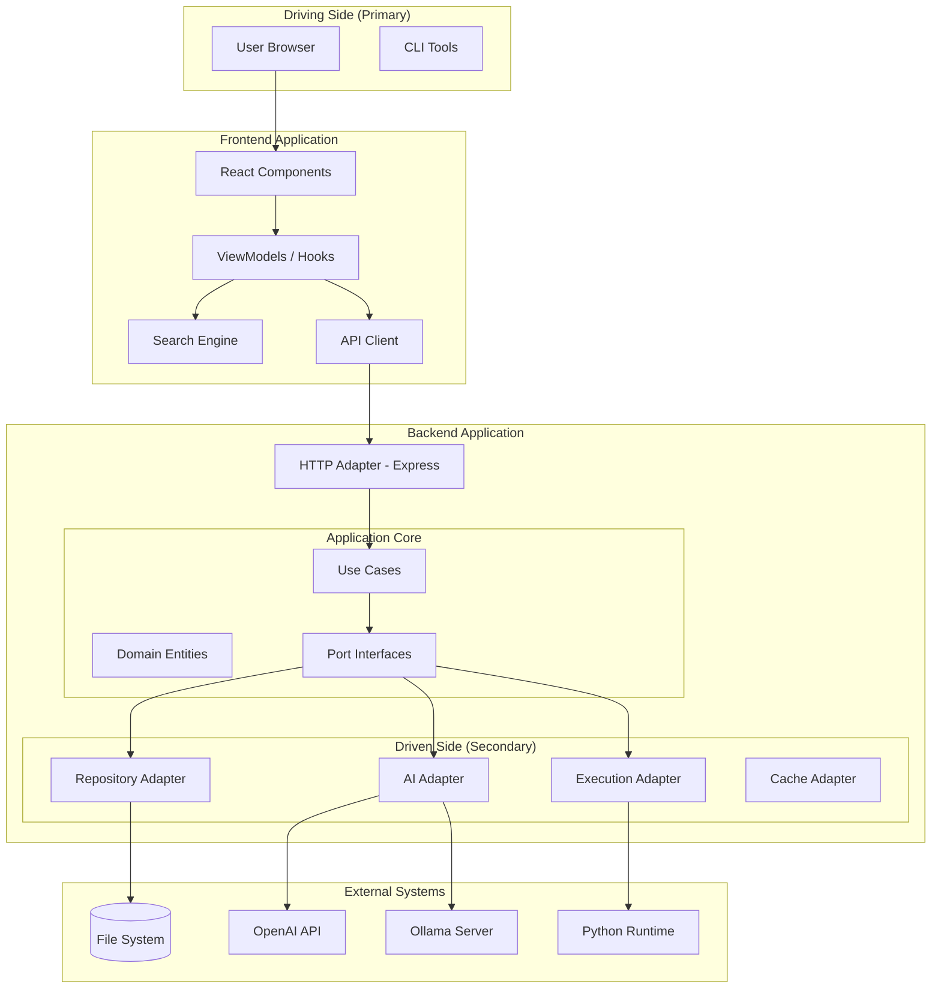

# Architecture Overview

Codenium follows a **Hexagonal Architecture** (also known as Ports & Adapters) pattern. This design ensures clean separation between business logic and external dependencies, making the system highly testable and maintainable.

---

## High-Level Architecture



---

## Core Principles

### 1. Dependency Inversion

The core business logic depends on **abstractions (ports)**, not concrete implementations:

```typescript
// Port (Interface)
interface AIService {
    generateHint(problem: string, code: string): Promise<HintResult>;
    explainSolution(code: string, title: string): Promise<ExplanationResult>;
}

// Application uses the port
class ProblemService {
    constructor(private aiService: AIService) {}
    
    async getHint(problem: string, code: string) {
        return this.aiService.generateHint(problem, code);
    }
}
```

### 2. Adapter Pattern

Concrete implementations adapt external systems to our ports:

```typescript
// OpenAI Adapter
class OpenAIAdapter implements AIService {
    async generateHint(problem: string, code: string) {
        // OpenAI-specific implementation
    }
}

// Ollama Adapter  
class OllamaAdapter implements AIService {
    async generateHint(problem: string, code: string) {
        // Ollama-specific implementation
    }
}
```

### 3. Composition Root

Dependencies are wired together at application startup:

```typescript
// api/index.ts - Composition Root
const aiService = process.env.AI_PROVIDER === 'openai' 
    ? new OpenAIAdapter() 
    : new OllamaAdapter();

const problemService = new ProblemService(
    new FileProblemRepository(),
    aiService,
    new LocalExecutionService()
);
```

---

## Layer Breakdown

### Frontend Layer

| Component | Responsibility |
|-----------|----------------|
| **UI Components** | React components for rendering |
| **ViewModels** | Business logic hooks (useProblems, useSolution) |
| **Services** | API client for backend communication |
| **Utils** | Search engine, storage, transpiler |

### Application Layer

| Component | Responsibility |
|-----------|----------------|
| **ProblemService** | Orchestrates problem-related operations |
| **Use Cases** | Single-purpose business operations |

### Domain Layer

| Component | Responsibility |
|-----------|----------------|
| **Entities** | Problem, Solution data structures |
| **Ports** | Interface definitions (AIService, ExecutionService, ProblemRepository) |

### Infrastructure Layer

| Component | Responsibility |
|-----------|----------------|
| **CacheService** | In-memory caching with TTL |
| **JobQueue** | Background job processing |
| **ProgressStore** | User progress persistence |
| **RateLimiter** | API rate limiting middleware |

### Adapter Layer

| Adapter | External System |
|---------|-----------------|
| **FileProblemRepository** | JSON file system |
| **OpenAIAdapter** | OpenAI GPT API |
| **OllamaAdapter** | Local Ollama LLM |
| **LocalExecutionService** | Python/Node.js code runners |

---

## Data Flow

### Request Flow

```
User Action → React Component → ViewModel Hook → API Client 
    → Express Route → ProblemService → Port → Adapter → External System
```

### Example: Get AI Hint

1. User clicks "Get Hint" button
2. `TutorChat` component calls `useTutor` hook
3. Hook calls `TutorAPI.chat()`
4. API client sends POST to `/api/tutor`
5. Express route calls `ProblemService.chatWithTutor()`
6. Service uses `AIService` port
7. Adapter (OpenAI/Ollama) makes external API call
8. Response flows back through the same path

---

## Key Design Decisions

### Why Hexagonal Architecture?

| Benefit | Description |
|---------|-------------|
| **Testability** | Core logic can be tested without external dependencies |
| **Flexibility** | Easy to swap implementations (e.g., OpenAI → Ollama) |
| **Maintainability** | Clear boundaries prevent coupling |
| **Scalability** | Adapters can be independently optimized |

### Why JSON Data Store?

- **Simplicity**: No database setup required
- **Portability**: Data ships with the code
- **Performance**: In-memory caching eliminates I/O
- **Versioning**: Data changes tracked in Git

### Why Python for Code Execution?

- **LeetCode Compatibility**: Most solutions are in Python
- **Sandboxing**: Easier to isolate execution
- **Performance**: Python subprocess is lightweight

---

## Related Documentation

- [Directory Structure](./Directory-Structure.md) - File organization
- [Domain Model](./Domain-Model.md) - Entity definitions
- [Backend Guide](./Backend-Guide.md) - Server implementation details
